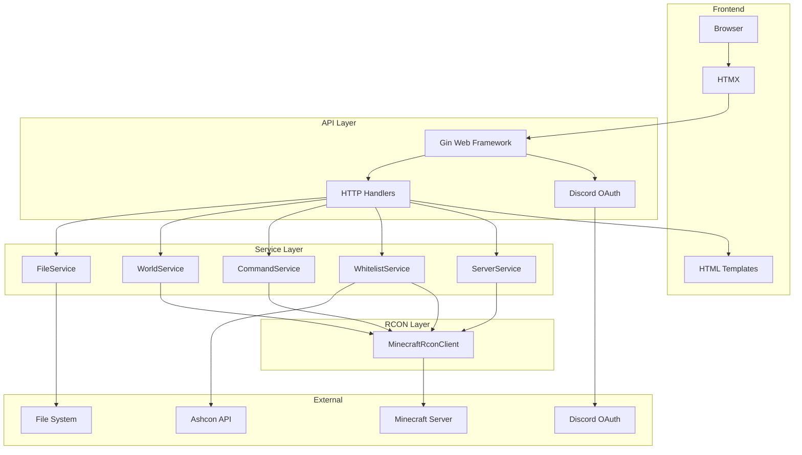
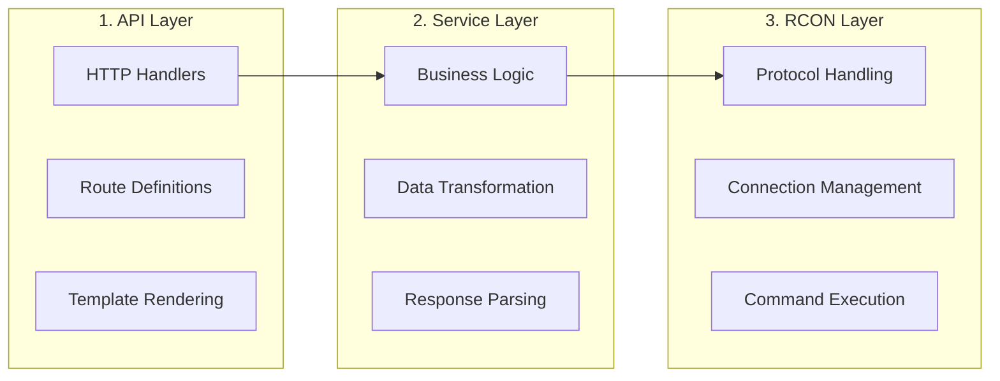
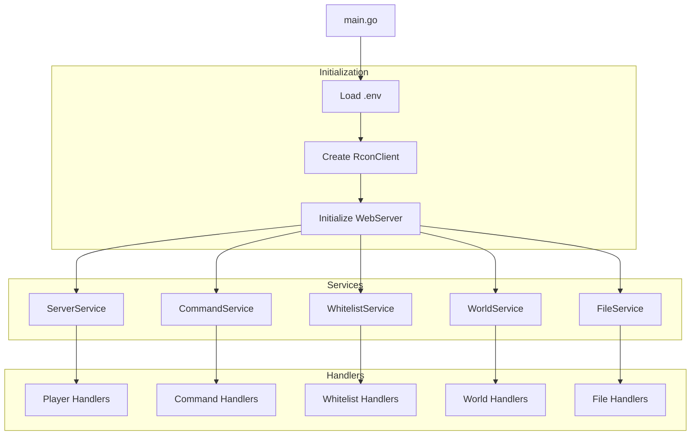
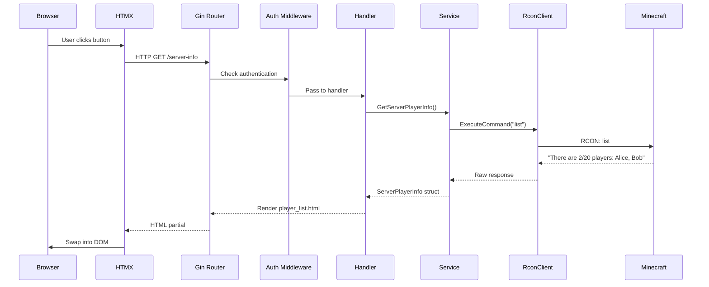
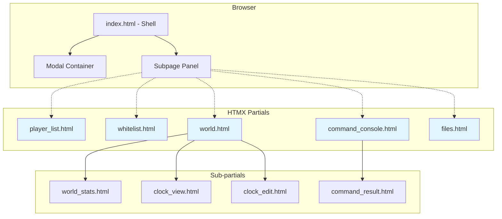
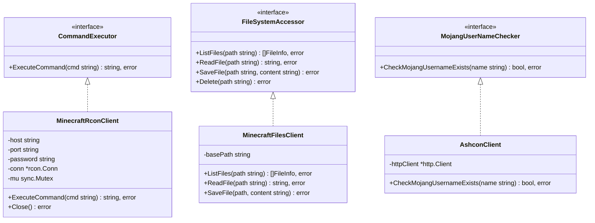
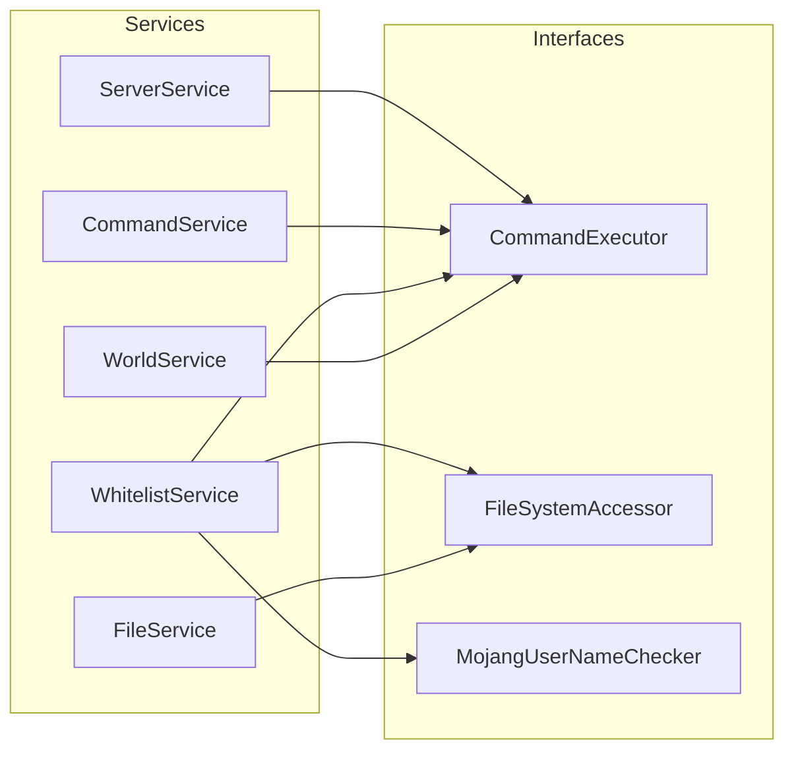
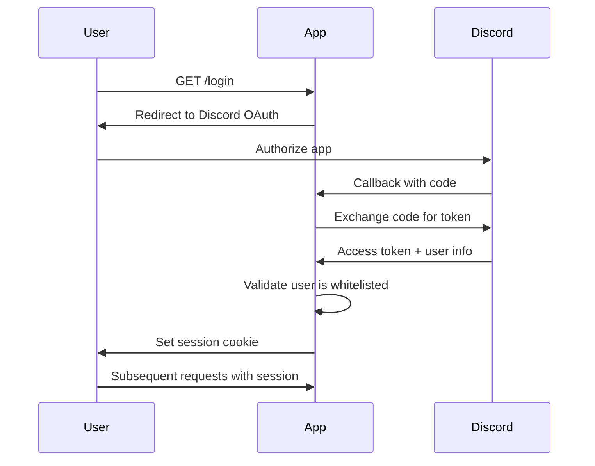
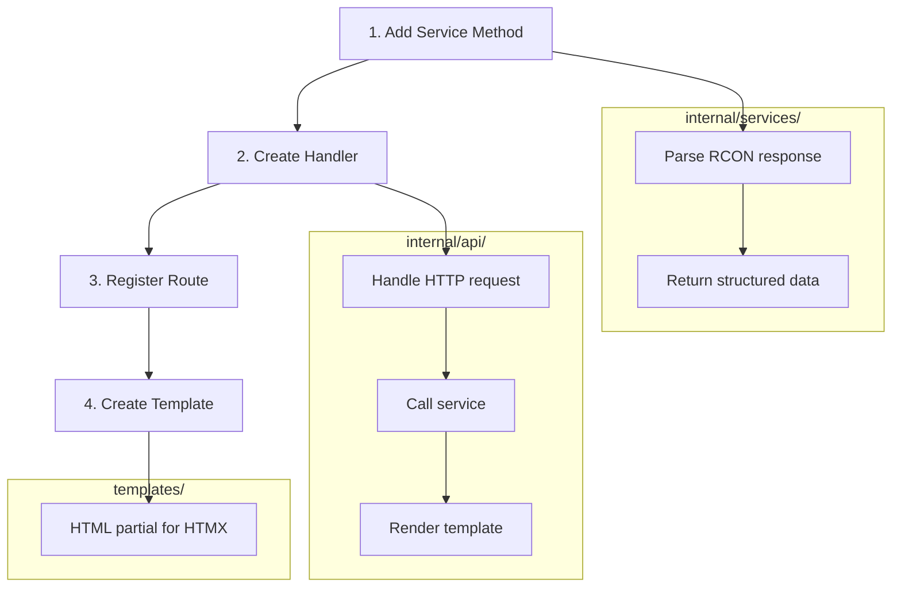

# Architecture

This document describes the architecture of the MC Admin web application, a Go-based tool for managing Minecraft servers via RCON.

## Overview



## Three-Layer Architecture

The codebase follows a clean three-layer architecture pattern with clear separation of concerns:



### Layer Responsibilities

| Layer | Location | Responsibility |
|-------|----------|----------------|
| **API** | `internal/api/` | HTTP routing, request handling, authentication, template rendering |
| **Service** | `internal/services/` | Business logic, data transformation, RCON response parsing |
| **RCON** | `internal/rcon/` | Low-level RCON protocol communication, connection management |

## Directory Structure

```
mc-admin/
├── main.go                     # Application entry point
├── internal/
│   ├── rcon/                   # RCON layer
│   │   └── client.go           # MinecraftRconClient
│   ├── services/               # Service layer
│   │   ├── server.go           # Player info
│   │   ├── command.go          # Raw commands
│   │   ├── whitelist.go        # Whitelist management
│   │   ├── world.go            # World/time operations
│   │   ├── files.go            # File operations
│   │   └── gametime.go         # Game time parsing
│   ├── api/                    # API layer
│   │   ├── server.go           # Route initialization
│   │   ├── player.go           # Player handlers
│   │   ├── command.go          # Command console
│   │   ├── whitelist.go        # Whitelist handlers
│   │   ├── world.go            # World handlers
│   │   ├── files.go            # File handlers
│   │   └── auth.go             # Discord OAuth
│   ├── clients/                # External API clients
│   │   └── ashcon.go           # Mojang username verification
│   ├── files/                  # File system abstraction
│   │   └── client.go           # MinecraftFilesClient
│   ├── config/                 # Configuration
│   │   └── environment.go      # Environment variables
│   └── utils/                  # Utilities
│       ├── strings.go
│       └── htmx.go
├── templates/                  # HTML templates
└── static/                     # CSS, images
```

## Dependency Flow



Dependencies are injected from `main.go` downward:

1. **main.go** creates the `MinecraftRconClient` from environment variables
2. **api.InitializeWebServer()** receives the client and creates all services
3. **Services** receive the RCON client via constructor injection
4. **Handlers** are factory functions that close over service dependencies

## Request Flow



## Frontend Architecture

The frontend uses server-side rendering with HTMX for dynamic updates without JavaScript frameworks.



### HTMX Pattern

```html
<!-- Button triggers partial replacement -->
<button hx-get="/whitelist"
        hx-target="#subpage-panel"
        hx-swap="innerHTML">
  Whitelist
</button>

<!-- Panel content is swapped dynamically -->
<div id="subpage-panel">
  <!-- Partial HTML loaded here -->
</div>
```

## Key Interfaces



## Service Dependencies



## HTTP Routes

| Method | Route | Handler | Description |
|--------|-------|---------|-------------|
| GET | `/` | Index | Main dashboard |
| GET | `/server-info` | GetServerInfo | Player list (HTMX partial) |
| GET | `/whitelist` | GetWhitelist | Whitelist management |
| POST | `/whitelist/toggle` | ToggleWhitelist | Enable/disable whitelist |
| POST | `/whitelist/player` | AddWhitelistPlayer | Add player to whitelist |
| DELETE | `/whitelist/player/:name` | RemoveWhitelistPlayer | Remove player |
| GET | `/players/:name/kick` | GetKickPlayer | Kick confirmation dialog |
| POST | `/players/:name/kick` | KickPlayer | Execute kick |
| GET | `/rcon` | GetCommandConsole | RCON console |
| POST | `/commands/execute` | ExecuteRawCommand | Run RCON command |
| GET | `/world/stats` | GetWorldStats | World statistics |
| GET | `/world/clock` | GetClock | Time display |
| POST | `/world/time` | SetTime | Set game time |
| GET | `/files` | GetFiles | File browser |
| POST | `/files/upload` | UploadFile | Upload file |
| DELETE | `/files/delete` | DeleteFile | Delete file |

## Authentication Flow



## Adding New Features

### Adding a New RCON Command



### Example: Adding a "Ban Player" feature

1. **Service** (`internal/services/server.go`):
```go
func (s *ServerService) BanPlayer(name, reason string) error {
    cmd := fmt.Sprintf("ban %s %s", name, reason)
    _, err := s.rconClient.ExecuteCommand(cmd)
    return err
}
```

2. **Handler** (`internal/api/player.go`):
```go
func handleBanPlayer(serverService *services.ServerService) gin.HandlerFunc {
    return func(c *gin.Context) {
        name := c.Param("name")
        reason := c.PostForm("reason")
        if err := serverService.BanPlayer(name, reason); err != nil {
            // Handle error
        }
        c.HTML(200, "ban_success.html", nil)
    }
}
```

3. **Route** (`internal/api/server.go`):
```go
protected.POST("/players/:name/ban", handleBanPlayer(parts.ServerService))
```

4. **Template** (`templates/ban_success.html`):
```html
<div class="toast success">Player banned successfully</div>
```

## Configuration

### Environment Variables

| Variable | Required | Default | Description |
|----------|----------|---------|-------------|
| `RCON_PASSWORD` | Yes | - | RCON password |
| `RCON_HOST` | No | localhost | Minecraft server host |
| `RCON_PORT` | No | 25575 | RCON port |
| `DISCORD_CLIENT_ID` | Yes | - | Discord OAuth client ID |
| `DISCORD_CLIENT_SECRET` | Yes | - | Discord OAuth secret |
| `SESSION_SECRET` | Yes | - | Session encryption key |

### Kubernetes Deployment

For Kubernetes environments, use `start-with-k8s.sh`:

| Variable | Default | Description |
|----------|---------|-------------|
| `K8S_NAMESPACE` | mc-red | Kubernetes namespace |
| `K8S_POD_SELECTOR` | app=mc-red-minecraft | Pod label selector |
| `LOCAL_PORT` | 25575 | Local port for forwarding |
