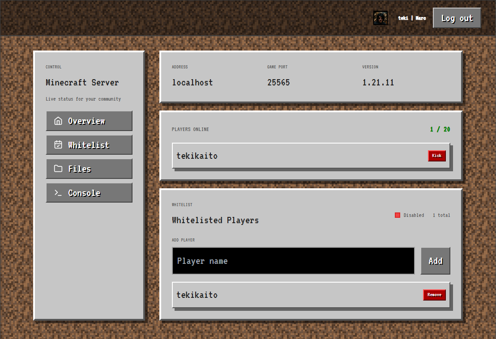

# mc-admin


A web-based administration panel for Minecraft servers. Its created to make server management easier and more accessible, providing real-time insights and control over server operations. Its designed to look like a native Minecraft interface, ensuring a familiar experience for server administrators.



## Features

- **Real-time Player Monitoring**: View currently online players with auto-refresh
- **Whitelist Management**: Add and remove players from the server whitelist with Mojang username validation
- **Player Actions**: Kick players directly from the web interface
- **RCON Console**: Execute raw RCON commands with syntax highlighting
- **Discord OAuth Authentication**: Secure access control via Discord login
- **Server Information Display**: Customizable server name, version, and description
- **HTMX-Powered UI**: Dynamic updates without page refreshes
- **Graceful Shutdown**: Proper cleanup of connections and resources

## Architecture

The application follows a clean three-layer architecture:

1. **Protocol Layer** (`internal/rcon/`): Low-level RCON protocol communication using the `github.com/gorcon/rcon` library
2. **Service Layer** (`internal/services/`): Business logic and data transformation
3. **API Layer** (`internal/api/`): HTTP handlers and routing using the Gin framework

All HTML is rendered server-side with templates located in `templates/`, and HTMX is used for dynamic content updates.

## Prerequisites

- Go 1.25.4 or later
- A Minecraft server with RCON enabled
- Discord application credentials (for authentication)
- Optional: Kubernetes cluster (for remote server access)

## Quick Start

1. Clone the repository:

```bash
git clone git@github.com:tekikaito/mc-admin.git
cd mc-admin
```

2. Create a `.env` file based on the provided `.env.example`:

```bash
cp .env.example .env
```

3. Fill in the required environment variables in `.env`:

- `RCON_PASSWORD`: Your Minecraft server's RCON password
- `DISCORD_CLIENT_ID`, `DISCORD_CLIENT_SECRET`, `DISCORD_REDIRECT_URI`: Your Discord OAuth credentials (if using Discord authentication)

4. Run the application:

```bash
go run main.go
```

6. Open your browser and navigate to `http://localhost:8080`

## Discord OAuth Setup

1. Create an application in the [Discord Developer Portal](https://discord.com/developers/applications)
2. In OAuth2 settings, add a redirect URL:
   - Local development: `http://localhost:8080/auth/discord/callback`
   - Production: `https://your-domain/auth/discord/callback`
3. Copy the Client ID and Client Secret to your `.env` file
4. Optionally, restrict access by adding Discord user IDs to `DISCORD_ALLOWED_USER_IDS`

All routes except `/auth/*` require a valid Discord session. If `DISCORD_ALLOWED_USER_IDS` is set, only those users can sign in.

## Environment Variables Reference

### Required Variables

| Variable        | Description                             |
| --------------- | --------------------------------------- |
| `RCON_PASSWORD` | RCON password for your Minecraft server |

### Optional Variables

| Variable                          | Default                          | Description                                                |
| --------------------------------- | -------------------------------- | ---------------------------------------------------------- |
| `RCON_HOST`                       | `localhost`                      | Minecraft server hostname or IP                            |
| `RCON_PORT`                       | `25575`                          | RCON port on the Minecraft server                          |
| `SERVER_NAME`                     | `Minecraft Server`               | Display name shown in the UI                               |
| `SERVER_HOST`                     | `localhost`                      | Public server address displayed in the UI                  |
| `GAME_PORT`                       | `25565`                          | Minecraft game port displayed in the UI                    |
| `SERVER_VERSION`                  | `Unknown Version`                | Server version displayed in the UI                         |
| `SERVER_DESCRIPTION`              | `Live status for your community` | Server description text                                    |
| `MINECRAFT_DATA_DIR`              | `/data`                          | Directory path for Minecraft server data                   |
| `MAX_FILE_DISPLAY_SIZE`           | `1048576`                        | Max size (in bytes) for displaying files in the UI         |
| `DISCORD_OAUTH_ENABLED`           | `false`                          | Enable Discord OAuth authentication                        |
| `ENABLE_MINECRAFT_USERNAME_CHECK` | `false`                          | Enable Mojang username validation for whitelist management |

### Conditional Variables

Those variablesa are required only if a feature flag is enabled (by setting its value to `true`).

Feature-Flag: `DISCORD_OAUTH_ENABLED`

| Variable                   | Default                                 | Description                                                          |
| -------------------------- | --------------------------------------- | -------------------------------------------------------------------- |
| `SESSION_SECRET`           | -                                       | Secret key for session encryption (use a long random string)         |
| `DISCORD_CLIENT_ID`        | -                                       | Discord OAuth application client ID                                  |
| `DISCORD_CLIENT_SECRET`    | -                                       | Discord OAuth application client secret                              |
| `DISCORD_REDIRECT_URI`     | -                                       | OAuth callback URL                                                   |
| `DISCORD_ALLOWED_USER_IDS` | (`nil` = every discord user is allowed) | Comma-separated list of Discord user IDs allowed to access the panel |

## Development

### Local Setup

1. Ensure you have Go installed (version 1.25.4 or later)
2. Clone the repository and navigate to the project directory
3. Create and configure a `.env` file as described in the Quick Start section
4. Run a local Minecraft server with RCON enabled for testing

```bash
docker compose -f minecraft.docker-compose.yml up -d
```

5. Start the application:

```bash
go run main.go
```

### Running Tests

```bash
go test ./...
```
